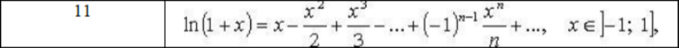
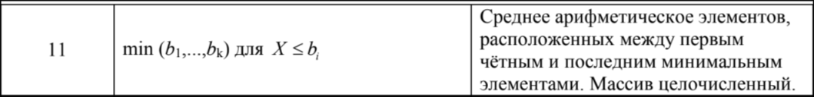
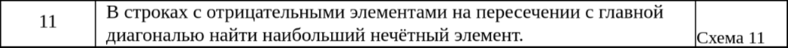
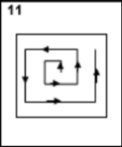
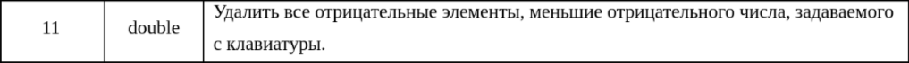

# HSE_labs

## Лабораторная работа №1.

**ВЫЧИСЛЕНИЯ ПО РЕКУРРЕНТНЫМ ФОРМУЛАМ С ПОМОЩЬЮ ОПЕРАТОРОВ ЦИКЛА**

Вычислить приближенное значение функции, вычислив сумму конечного числа элементов ряда двумя способами, используя разные типы циклов:
1) с заданной точностью (критерий остановки цикла – значение текущего члена ряда не превосходит точность);
2) для заданного количества членов ряда.

Дополнительные требования:
Переход к способу вычисления реализовать на этапе выполнения с 
помощью условного оператора. Проверять корректность введенных 
данных на этапе выполнения. В случае ввода пользователем некорректных 
данных (например, отрицательное число членов ряда) на этапе выполнения, 
возвращать его к повторному вводу, не завершая выполнение программы. 
Не использовать математические функции (из `math.h`) для вычисления результата.

## Лабораторная работа No2

**ОБРАБОТКА ДАННЫХ В ОДНОМЕРНОМ МАССИВЕ**

Числовой массив B (тип массива указан в формулировке второго задания)
содержит `k` элементов. 
Элементы массива и пороговые значения `X`, `Y` вводятся с клавиатуры. 
Написать подпрограммы создания массива и вывода его на экран.
В первом задании требуется написать функцию нахождения соответствующего 
варианту максимального/минимального значения, а во втором – 
среднего арифметического указанных в условии элементов («между» понимать 
строго – не включая найденные позиции). Оба задания реализовать в одной программе.

## Лабораторная работа № 3.

**ОБРАБОТКА ДВУМЕРНЫХ МАССИВОВ**

Дана целочисленная матрица размера n*m, где `1 <= n,m <= 10`. `k = min(m,n)`
Программа должна быть разбита на несколько функций и обязательно содержать:функцию формирования исходного массива;
- функцию вывода исходного массива;
- одну или более функций, реализующих вычислительную часть алгоритма задания 1, и возвращающих искомые значения в программу;
- функцию последовательного вывода элементов квадратного левого верхнего фрагмента матрицы размерностью `k x k` в порядке, заданным схемой на рисунке задания 2. 

Все функции должны содержать список параметров, причём адрес 
массива должен передаваться как параметр функции. 
Функция **main** должна содержать только операторы вызова функций.
Использовать статический массив. Дополнительных массивов не использовать!
Схемы вывода представлены на рисунке.

## Лабораторная работа № 4. 

**Модификация одномерных динамических массивов.**

Размер динамического массива вводится пользователем на этапе выполнения.
Тип массива указан в задании. Элементы массива вводятся с клавиатуры.
Написать функции создания и заполнения массива, вывода массива, 
модификации массива указанных элементов. Вспомогательные массивы
не использовать. Функция main должна содержать только объявление 
необходимых переменных и вызовы функций, указанных выше.

## Экзаменационная работа № 1.

Дана строка символов (не более 100 символов), все слова в 
которой отделены друг от друга пробелами, и символ 
(определяется пользователем на этапе выполнения). Вывести
все слова, не содержащие в себе заданный символ.

## Лабораторная работа № 5.

Дана строка, содержащая от 1 до 30 слов, в каждом из которых 
от 1 до 10 латинских букв и/или цифр; между соседними словами
– запятая, за последним словом – точка. Напечатать эту же
последовательность слов, но в обратном порядке.